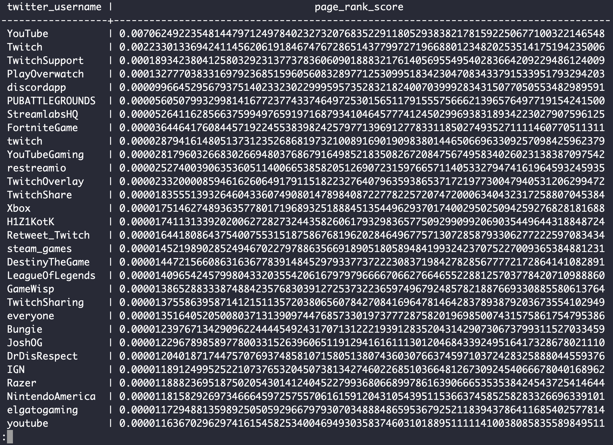

# Graph Analysis

## The Twitter dataset

Our research group downloaded the tweets written by a set of Twitch streamers   

        idx                 INTEGER   # aribtrary idx value
        create_time         STRING
        id                  FLOAT     # Tweet id
        in_reply            STRING    # id of Tweet that this row is replying to, or Null
        like_num            FLOAT     # number of likes
        quoted_org_id       FLOAT     # id of orig tweet if this row quotes another tweet
        retweet_num         FLOAT     # number of times this row was retweeted
        retweet_org_id      FLOAT     # id of orig tweet if this row is a retweet
        text                STRING    
        twitter_username    STRING    
        twitch_username     STRING   

## Usage

I provide two platform for this analysis

* Google Bigquery
* PostgreSQL

#### For Bigquery

        python graph.py [path_to_credentials_file]

If everything has been setup correctly, you will be able to see the output for the testquery function inside the graph.py file.

To start working on your solutions, you must write queries for each question inside the corresponding functions. You should uncomment ``funcs_to_test = [q1, ...]`` and comment out ``funcs_to_test = [testquery]`` in order to actually run their queries.

#### For PostgreSQL

```python
python postgresql.py
```

Dependency:

* `Postgres`
* `Python > 3.6`
* `sqlalchemy`

## Queries

##### Q1

`id` of Tweets that contain both the phrase "going live" and a URL to twitch.com.  

##### Q2
Day of the week on average gets the maximum number of likes.

- day (day of the week)
- avg_likes (average number of likes for the day)

##### Q3

Twitch streamers sometimes @ mention other streamers in their tweets by adding a "@" prefix to the other streamer's Twitter username.  For instance, the following tweet mentions `anotheruser`.

      Thanks to @anotheruser for a great broadcast!

Tweets that @ mention another user. 

- src (the twitter_username of the user)
- dst (the twitter_username of the user mentioned in the tweet)


##### Q4
User has the highest indegree and which user has the highest outdegree.

- max_indegree
- max_outdegree

##### Q5
popular_unpopular (conditional probability P(@ mentions popular user | is unpopular))

##### Q6
The number of triangles in the graph.

For the first part, your answer should be a single query containing the column:
- no_of_triangles

##### Q7
Top 100 nodes with the highest PageRank in the graph.

## PageRank

### introduction

This algorithm works as follows - Assume a small universe of four web pages: A, B, C and D. PageRank is initialized to the same value for all pages since we assume a probability distribution between 0 and 1 as the PageRank for each node. Hence the initial value for each page in this example is 0.25. If the only links in the system were from pages B->A, C->A and D->A, each link would transfer 0.25 PageRank to A upon the next iteration, for a total of 0.75 i.e. PR(A) = PR(B) + PR(C) + PR(D). 

Now, suppose instead that we have the links B->C, B->A, C->A, D->A, D->B, D->C. Thus, upon the first iteration, page B would transfer half of its existing value, or 0.125, to page A and the other half, or 0.125, to page C. Page C would transfer all of its existing value, 0.25, to the only page it links to, A. Since D had three outbound links, it would transfer one third of its existing value, or approximately 0.083, to A. At the completion of this iteration, page A will have a PageRank of approximately 0.458.
PR(A)=PR(B)/2 + PR(C)/1 + PR(D)/3.

Thus, we can write the PageRank of A as:
PR(A)= PR(B)/L(B) + PR(C)/L(C) + PR(D)/L(D) where L(x) gives us the number of outbound links for any node x. 

In general, the PageRank value for a page u is dependent on the PageRank values for each page v contained in the set containing all pages linking to page u, divided by the number of links from page v. 
It is given by the formula: 

To read more about PageRank, you can refer to the following link: [PageRank](http://home.ie.cuhk.edu.hk/~wkshum/papers/pagerank.pdf)

For this question, you will need to develop an iterative solution, i.e. your python code will act as a driver and issue multiple queries to BigQuery iteratively. As an example, we provided an iterative implementation of Breadth First Search on the starter code.

To execute 5 iterations using A as a start node, you can simply call ``bfs(client, 'A', 5)``.

The example saves the nodes visited at each iteration in a table ``distances``, along with their distance to the initial node. The function itself does not return any value (however, remind that you will be required to return values for Q7).

### My Result

